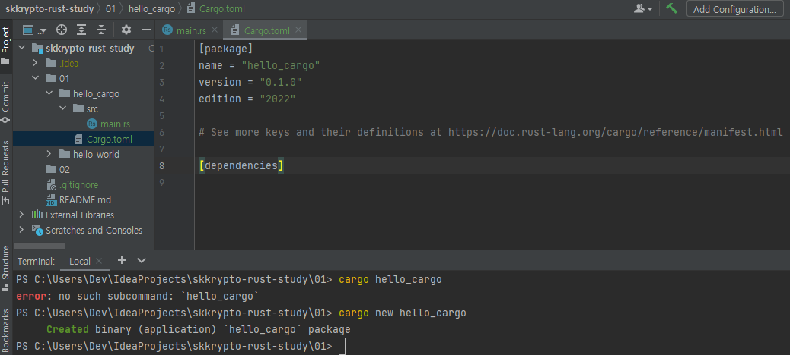
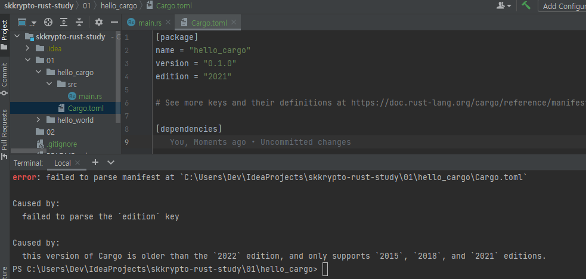
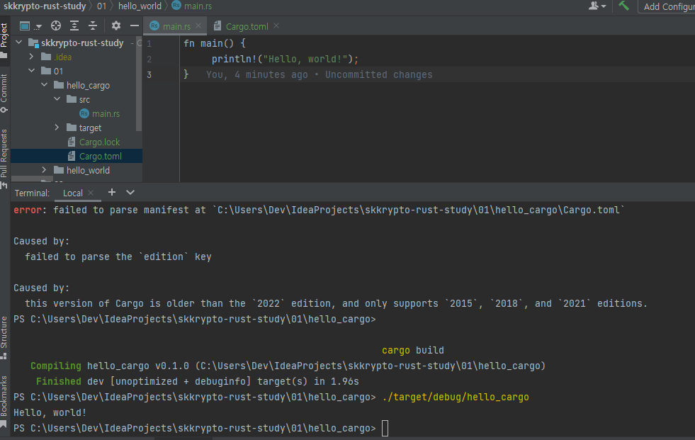
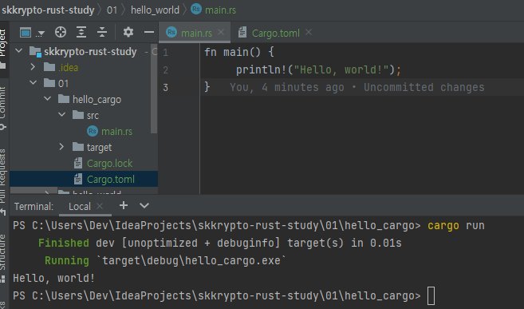
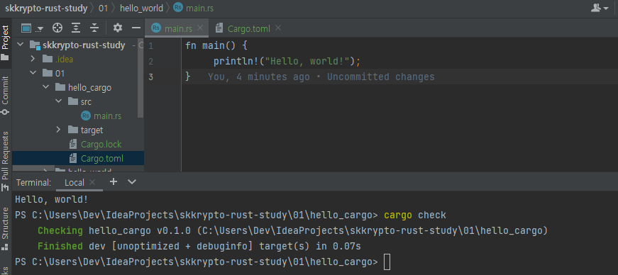

# SKKRYPTO 2022-2 Summer Vacation Study: Rust

### Reference materials
- [The Rust Programming Language](https://doc.rust-lang.org/book/ch01-00-getting-started.html)

## Contents

- hello, world!

- dependencies check

- build

- run

- check

