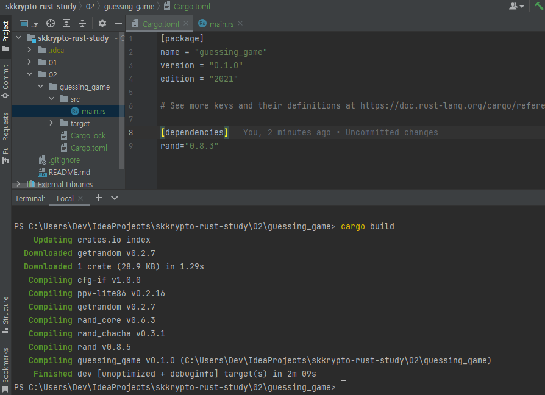

# SKKRYPTO 2022-2 Summer Vacation Study: Rust

### Reference materials
- [The Rust Programming Language](https://doc.rust-lang.org/book/ch02-00-guessing-game-tutorial.html)

## Contents

- make a project

- run skeleton code

- dependencies

- build

- run

- comparison

- loop

- run output

- winning case handling

- simple error handling

- complete code

